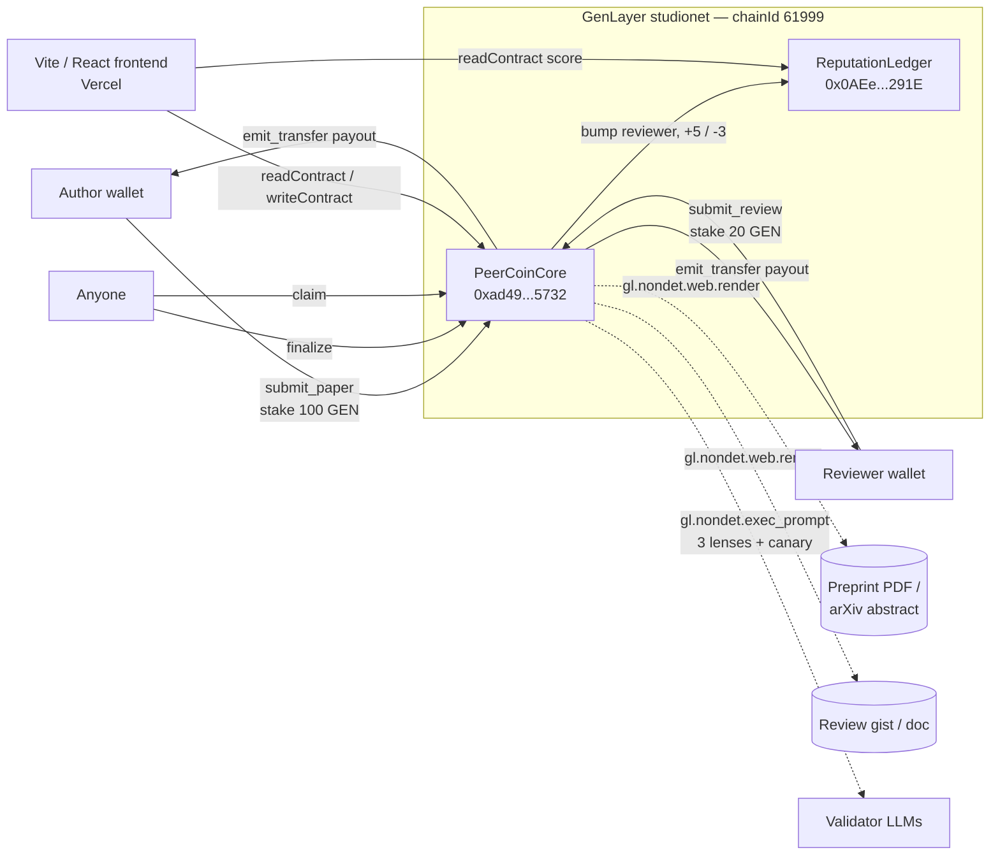
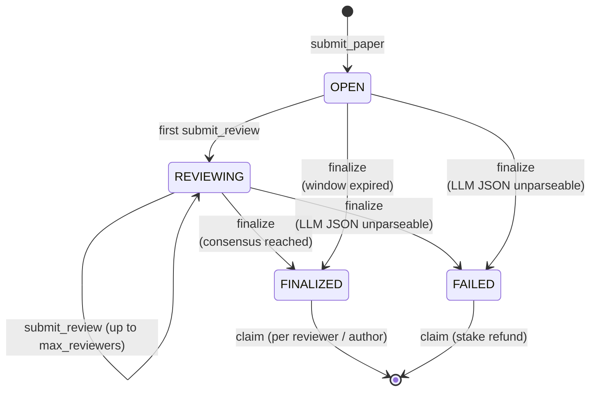
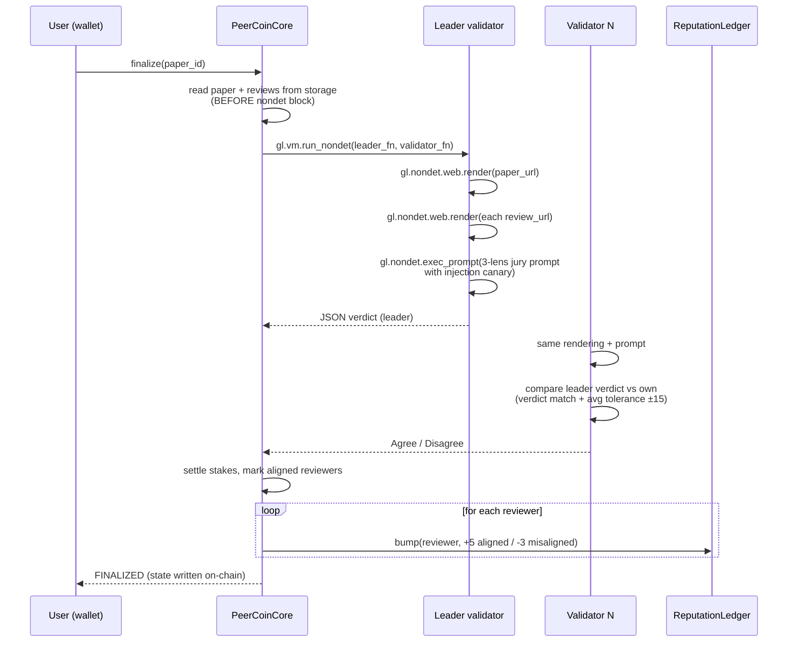
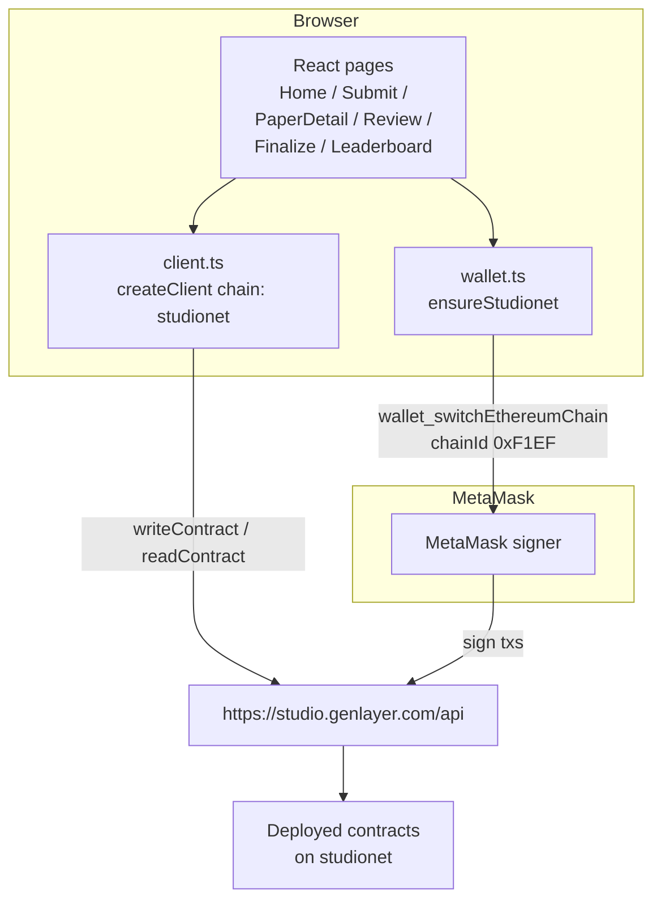

# PeerCoin — Architecture

## System Overview

PeerCoin runs entirely on GenLayer **studionet** (`chainId 61999`). Two Intelligent Contracts hold all state, and a Vite/React frontend calls them through `genlayer-js` with MetaMask signing. Nothing off-chain — the AI jury runs inside the consensus block via `gl.vm.run_nondet`.

## Contract Topology



## Lifecycle — Paper State Machine



## Non-deterministic Consensus Block — `finalize`



## Why the Leader/Validator split matters

- **Leader** runs the prompt once. The JSON it returns becomes the on-chain verdict if consensus is reached.
- **Validators** each rerun the same prompt independently and vote using `validator_fn`. The function compares **verdict** (`ACCEPT` vs `REJECT`) and the **average of `rigor/novelty/reproducibility`** with a `±15` tolerance. Free-text `reason` deliberately does **not** need to match — that is the difference between Trục 2 score 1 (schema match) and 4+ (semantic match).
- If validators disagree, `gl.vm.run_nondet` raises and the transaction reverts. There is no "leader wins by default" — an adversarial leader gets caught.

## Frontend ↔ Contract Interaction



## Directory Layout

```
6-PeerCoin/
├── contracts/
│   ├── peercoin_core.py          # main marketplace + AI jury (non-det)
│   └── reputation_ledger.py      # score bump / read (deterministic)
├── frontend/
│   ├── src/
│   │   ├── lib/
│   │   │   ├── client.ts         # genlayer-js client, contract addresses
│   │   │   └── wallet.ts         # MetaMask + wallet_switchEthereumChain
│   │   ├── components/
│   │   ├── pages/
│   │   └── App.tsx
│   └── .env                      # VITE_CONTRACT_ADDRESS, VITE_REPUTATION_ADDRESS
├── tests/                        # pytest + mocked genlayer module
├── scripts/
│   ├── deploy.md                 # step-by-step Studio deploy
│   └── seed.md                   # sample data walkthrough for demo
├── ARCHITECTURE.md               # this file
├── ECONOMICS.md                  # stake / reward math
├── SECURITY.md                   # threat model + hardening notes
├── CONTRIBUTING.md
├── CHANGELOG.md
└── README.md
```

## Storage schema — one place to reference

| Field | Type | Where | Note |
|---|---|---|---|
| `papers` | `TreeMap[str, Paper]` | Core | key = `str(paper_id)` (R19) |
| `reviews` | `TreeMap[str, TreeMap[str, Review]]` | Core | inner allocated via `gl.storage.inmem_allocate` (R18) |
| `seen_urls` | `TreeMap[str, bool]` | Core | dedup preprint URLs |
| `reputation` | `Address` | Core | ReputationLedger address |
| `admin` | `Address` | Core | deployer |
| `next_paper_id` | `bigint` | Core | monotonic id |
| `scores` | `TreeMap[str, i256]` | Rep | key = `str(addr)` |
| `core` | `Address` | Rep | authorized caller (set via `set_core`) |
| `admin` | `Address` | Rep | deployer |

All numeric persistence uses `bigint`, `u8`, or `i256`. No bare `int`, no `list`, no `dict` — see [SECURITY.md](SECURITY.md) and [`02-common-errors.md`](../gen-rules/02-common-errors.md) R14 / R18 / R19.

## Non-determinism boundaries

- Storage reads and address conversions happen **before** entering the nondet closure — closures capture Python values, not GenVM storage handles.
- `gl.nondet.web.render` and `gl.nondet.exec_prompt` are **only** called inside `leader_fn` / `validator_fn` passed to `gl.vm.run_nondet` (Rule #7).
- `validator_fn` returns `bool`. Any exception inside it is sandboxed by `run_nondet` — but we still return `False` explicitly for the `not isinstance(leader_res, gl.vm.Return)` branch so a leader error becomes a clean Disagree.

## Failure modes and recovery

| Failure | Effect | Recovery |
|---|---|---|
| LLM returns unparseable JSON on leader | Paper → `FAILED` | Author + all reviewers call `claim` to withdraw stakes |
| Validators disagree with leader | `finalize` tx reverts | Anyone can retry `finalize` — new leader/validators |
| Review window not expired + not enough reviewers | `_require` raises `UserError` | Wait for more reviewers or window expiry |
| Reviewer submits duplicate | `_require` raises | Reviewer picks a different paper |
| Duplicate preprint URL | `_require` raises on `submit_paper` | Author changes URL |

## Deploy addresses (studionet)

Source of truth: [.env.example](.env.example) and [frontend/src/lib/client.ts](frontend/src/lib/client.ts). Update both when redeploying.
